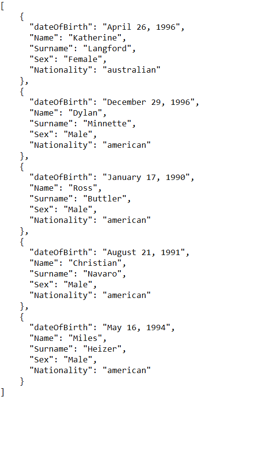

# First-Task-Movie-Star
A simple console application
The purpose of this application is to take a .json file from a directory and read it in the console
From the information, given from the .json file, the age of the specific movie star is calculated

# The json file

